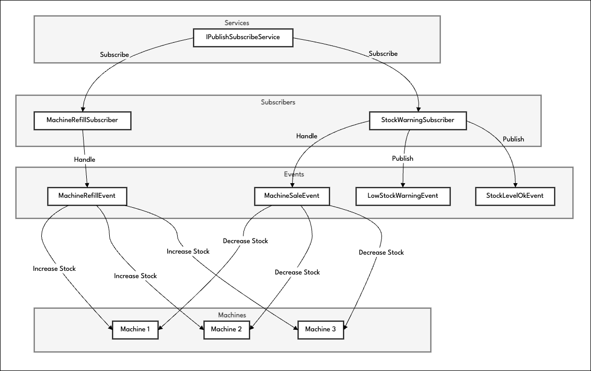

# Publish-Subscribe Mechanism in .NET Core (C#)

This project implements a simple Publish-Subscribe mechanism in .NET Core using C#. The mechanism allows subscribers to register for specific event types and receive notifications when those events occur.

## Overview Diagram

## Components

### 1. Machine
Represents a vending machine with an ID, name, and stock quantity.

### 2. Events
- `MachineSaleEvent`: Represents a machine sale event, which decreases the stock of a machine.
- `MachineRefillEvent`: Represents a machine refill event, which increases the stock of a machine.
- `LowStockWarningEvent`: Indicates that a machine's stock has dropped below 3.
- `StockLevelOkEvent`: Indicates that a machine's stock has reached 3 or above.

### 3. Subscribers
- `MachineRefillSubscriber`: Subscribes to `MachineRefillEvent` and increases the stock of the corresponding machine.
- `StockWarningSubscriber`: Subscribes to `MachineSaleEvent`, generates `LowStockWarningEvent` and `StockLevelOkEvent` based on stock levels, and handles them.

### 4. IPublishSubscribeService
The interface for the Publish-Subscribe service with methods for subscribing, unsubscribing, and publishing events.

### 5. PublishSubscribeService
An implementation of `IPublishSubscribeService` that manages subscribers and event publication.

## Usage

1. Create Instances of Machines:

   Start by creating instances of vending machines using the `Machine` class. Initialize their stock levels.

2. Initialize the Publish-Subscribe Service:

   Create an instance of the `PublishSubscribeService` class, which will manage subscribers and event publication.

3. Create Subscribers:

   Create instances of subscribers (`MachineRefillSubscriber` and `StockWarningSubscriber`) and subscribe them to specific event types using the `Subscribe` method of the `IPublishSubscribeService` interface.

4. Publish Events:

   Create instances of events (e.g., `MachineSaleEvent` or `MachineRefillEvent`) and use the `Publish` method of the `IPublishSubscribeService` interface to publish them. Subscribers will be notified and handle the events according to their logic.

5. Handle Events:

   Subscribers (`MachineRefillSubscriber` and `StockWarningSubscriber`) will handle events based on their logic. For example, `MachineRefillSubscriber` will increase the stock when a `MachineRefillEvent` occurs, and `StockWarningSubscriber` will generate `LowStockWarningEvent` or `StockLevelOkEvent` based on stock levels.

6. Unsubscribe (Optional):

   If you want to unsubscribe a subscriber from receiving specific events, you can use the `Unsubscribe` method of the `IPublishSubscribeService` interface.

7. Additional Event Handling:

   Remember that subscribers can create new events if desired. These events will be handled after all existing events are handled by other subscribers.

Customize the logic within subscribers and events to suit your specific requirements.

